
# HB-UNI-SenAct-4-4-Hutschine
# 4x 16A Wechelkontakte (Potentioalfrei) + 4 Eingänge (Schalter/Taster)

# Spannungsversorgung 9-36V mit Internen Netzteil oder 5V

## benötigte Hardware
**Vorschlag Bauteile**
* 1x Arduino Pro Mini **ATmega328P (3.3V/8MHz)**
* 1x CC1101 Funkmodul **(868 MHz)**
* 1x FTDI Adapter (wird nur zum Flashen benötigt)

**Netzteil nur zu Verwenden wenn Spannungsversorgung 9-36V**
* 1x Kondensator RAD FC 100/50 :: Elko radial, 100 uF, 50 V, 105°C, low ESR
* 1x Kondensator RAD FC 100/16 :: Elko radial, 100 uF, 16 V, 105°C, low ESR
* 1x Sicherung MINI TR 0,5A :: Kleinstsicherung zum Einlöten, träge 0,5A
* 1x Diode 1N 5819 :: Schottkydiode, 40 V, 1 A, DO-41
* 1x Schaltregler MC 34063 A , DIP-8
* 1x L-07HCP 47µH :: Stehende-Induktivität, 07HCP, Ferrit, 47µH
* 1x KERKO 100P :: Keramik-Kondensator 100P
* 1x Widerstand 1/4W 1,0K :: Widerstand, Kohleschicht, 1,0 kOhm, 0207, 250 mW, 5%
* 1x Widerstand 1/4W 3,0K :: Widerstand, Kohleschicht, 3,0 kOhm, 0207, 250 mW, 5%
* 2x Widerstand METALL 1,00 :: Widerstand, Metallschicht, 1,0 Ohm, 0207, 0,6 W, 1% **wenn weiter Hutschienen Module über das Netzteil mit 5V Versorgt werden sollen ist pro weiteres Modul je 1 Widerstand einzusetzen.**

**Weiter Bestückung**
* 1x ULN 2803A :: Darlington-Arrays, DIL-18 = TD 62083AP
* 4x FTR K1CK005W :: Miniatur-Leistungsrelais FTR-K1 5V, 1Wech., 16A
* 8x AKL 057-03 Anschlussklemme, 3-pol, alternativ 2x WAGO 236-412 **(es wird der Beschriftungsdruck Überdeckt)**
* 1x STAPELLEISTE 20 :: Stapelleiste, 20-polig, einreihig, Höhe 38mm
* 1x SL 1X10G 2,00 :: 10pol.-Stiftleiste, gerade, RM 2,00
* 5x LED 5mm
* 5x MEN 2819.5090 Abstandhalter für 5 mm LEDs, Länge 9 mm
* 5x 1/4W 330 :: Widerstand, Kohleschicht, 330 Ohm, 0207, 250 mW, 5%
* 5x Taster 6 x 6 x 17mm
* 1x CB HUTKIT 4 :: Leergehäuse, 58 x 71 x 90 mm, 4 TE

**Artikelnummern sind von Reichelt**

**Das Modul hat I2C nach aussen gefürht wenn jemand die Software weiter Entwickeln will. Die Pull Up Widerstände wären 2,2K Ohm und sind auf der Oberen Platine.** 

[Kontakt via Facebook](https://www.facebook.com/ronny.thomas.83)

[Software](https://github.com/jp112sdl/HB-UNI-SenAct-4-4)

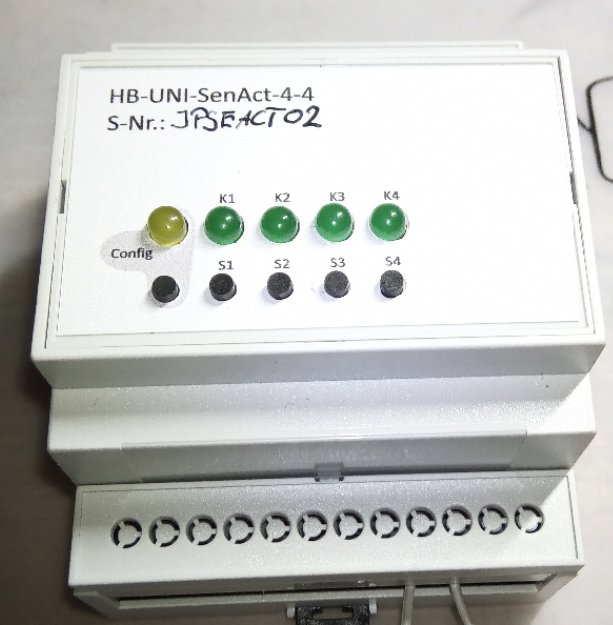
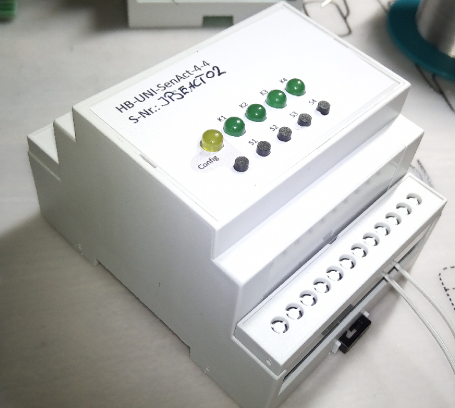

**wenn weitere Hutschienen Module über das Netzteil mit 5V Versorgt werden sollen ist pro weiteres Modul je 1 Widerstand 1Ohm einzusetzen.**

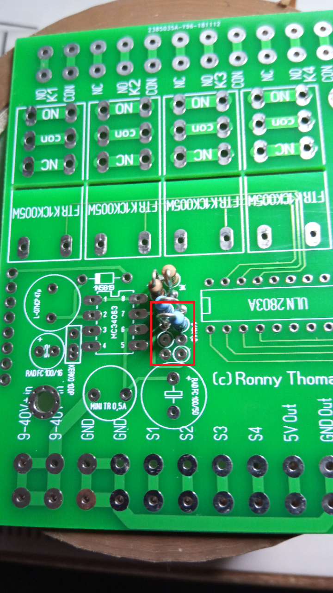
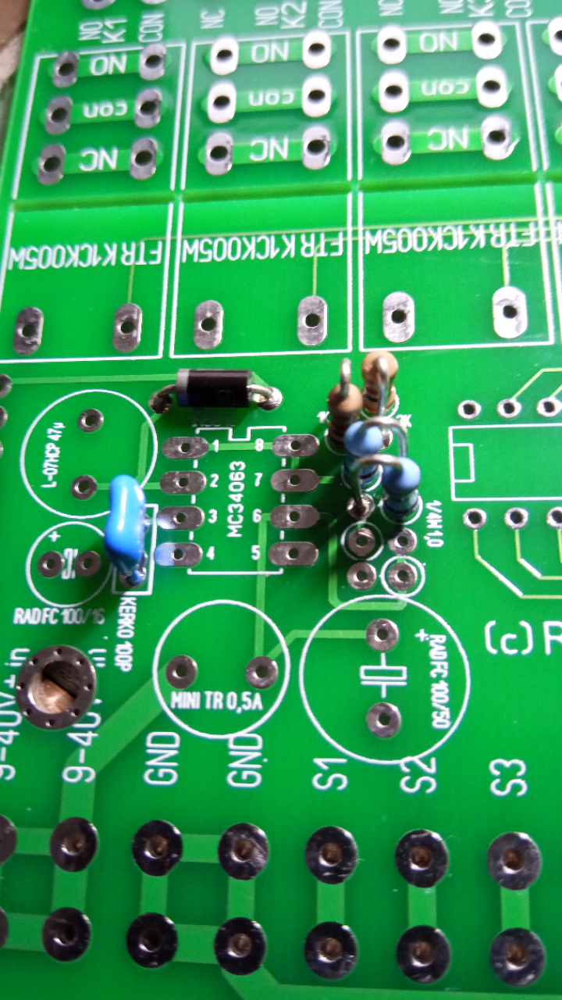

**Internen Netzteil auf 5V, bei Spannungsversorgung über 5V direkt wird das nicht benötigt!**

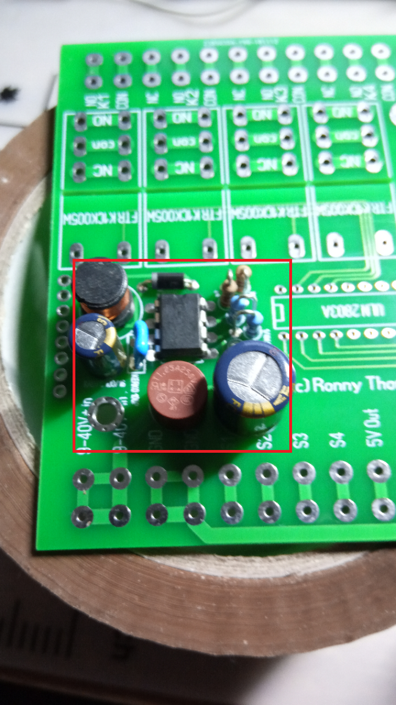
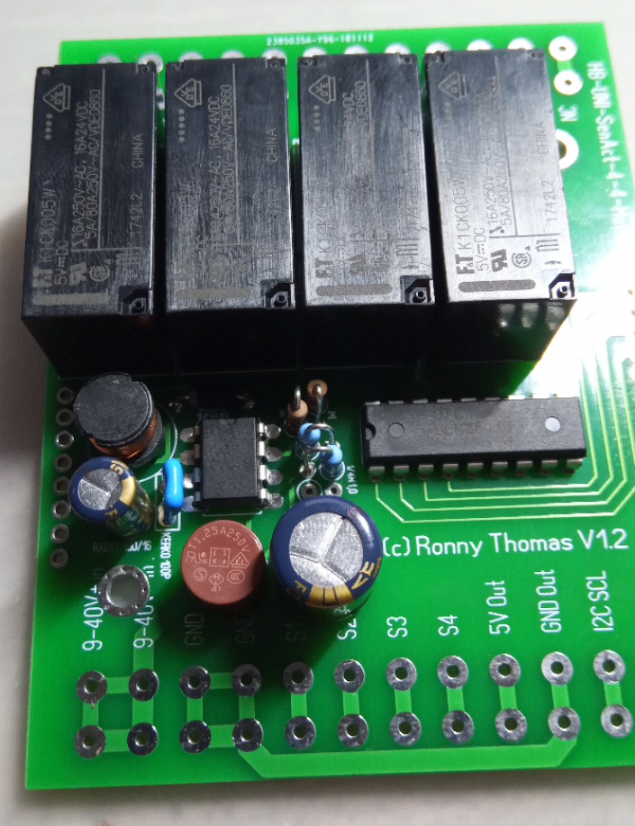
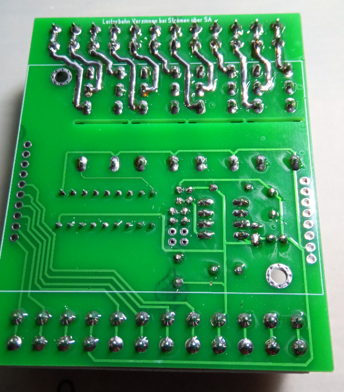
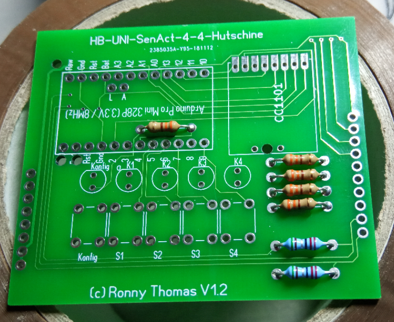
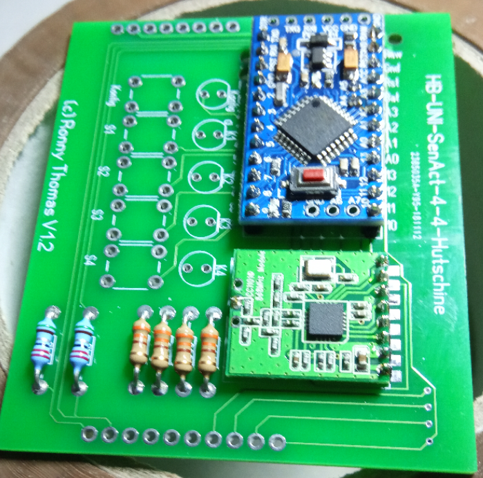
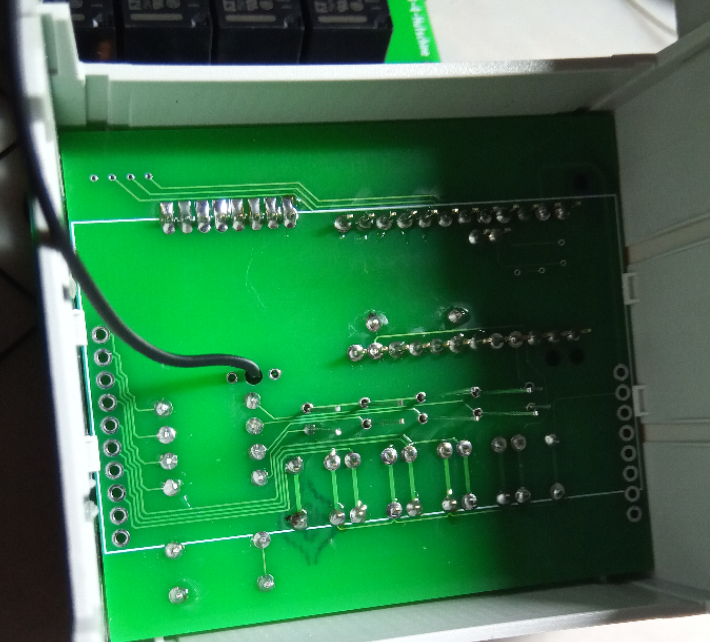
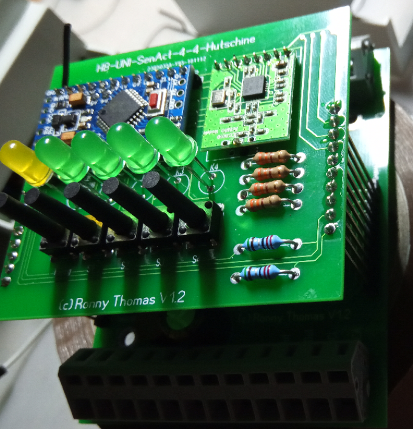
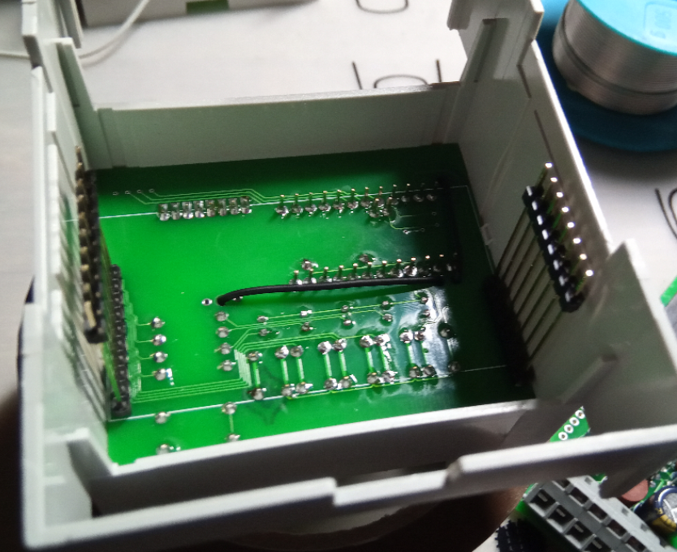
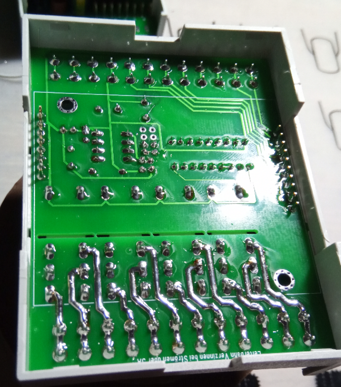
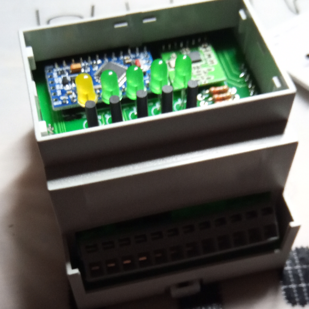
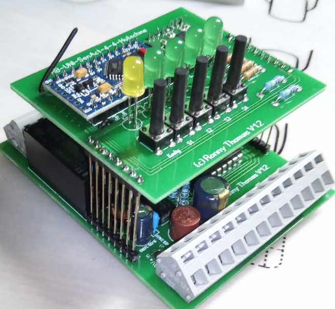

**Viel Spass bei Bauen**
